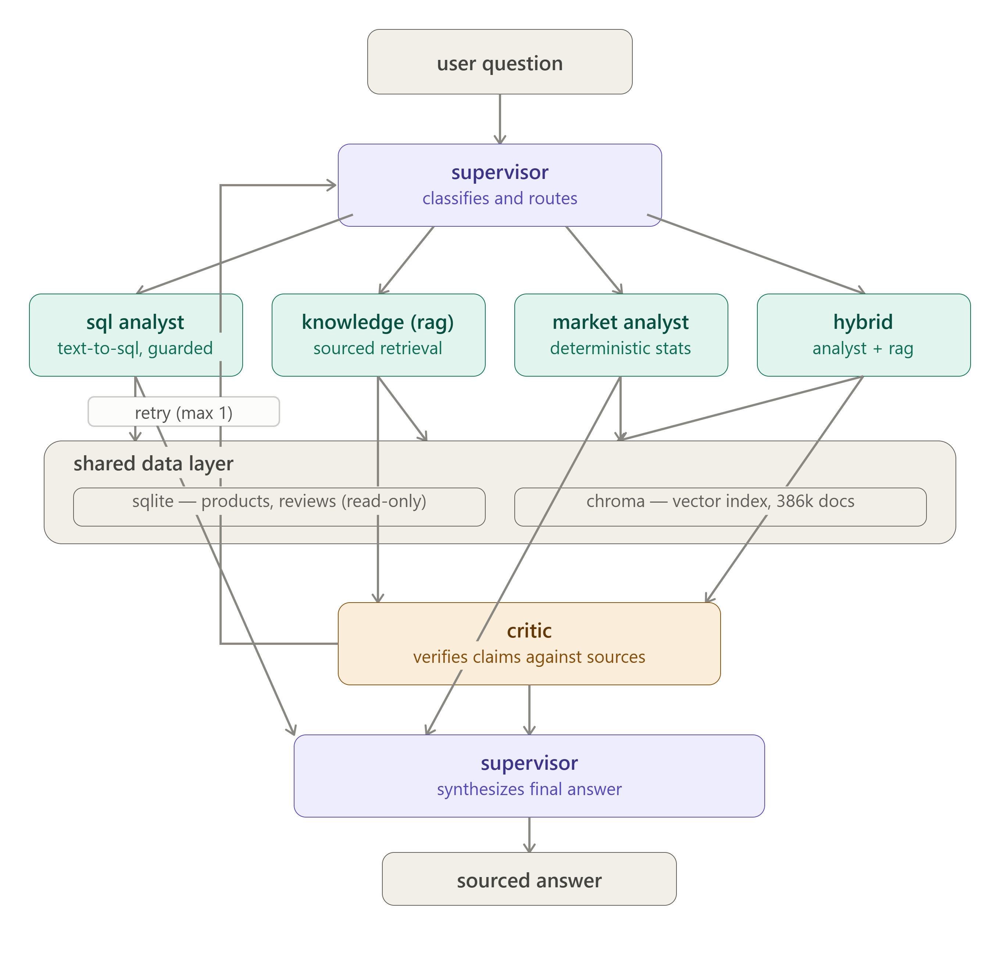
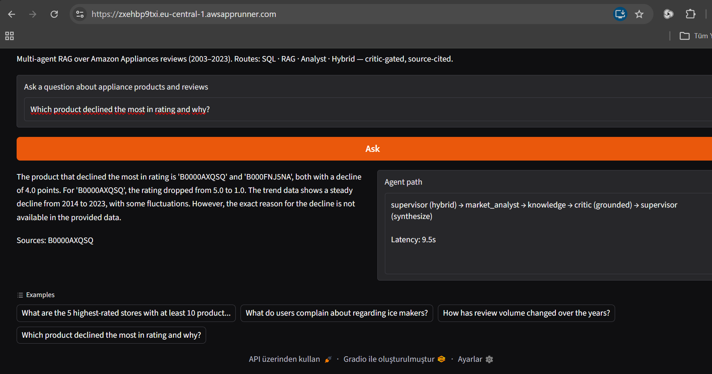

# 🛒 E-Commerce Product Intelligence Copilot

**Five specialized agents. One supervisor. Zero unverified claims.**



[](https://ecommerce-intel-copilot-u3hzffazrtbv4ayzfqhzet.streamlit.app/)
[](docs/aws-deployment.md)
[](tests/)
[](LICENSE)

A multi-agent RAG system that answers natural-language questions over 441,857 Amazon
appliance reviews — structured SQL, semantic retrieval, deterministic analytics, and a
groundedness critic, orchestrated behind a single supervisor.

**Live demo:** https://ecommerce-intel-copilot-u3hzffazrtbv4ayzfqhzet.streamlit.app/



## Architecture

```
user ──> SUPERVISOR ──> { SQL ANALYST │ KNOWLEDGE (RAG) │ MARKET ANALYST │ HYBRID } ──> CRITIC ──> answer
              ^                                                                           │ (retry ≤ 1)
              └───────────────────────────────────────────────────────────────────────────┘
```

| Agent | Responsibility | Backing |
|---|---|---|
| Supervisor | Classifies the question (sql / rag / analyst / hybrid / reject), synthesizes the final answer | LLM |
| SQL Analyst | Text-to-SQL over a read-only connection, hard-guarded to single SELECTs | LLM + SQLite |
| Knowledge (RAG) | Top-k semantic retrieval; answers strictly from context with `[asin]` citations | LLM + Chroma |
| Market Analyst | Deterministic analytics (rating trends, review volume, top movers) — the LLM only narrates numbers it never computes | Python |
| Critic | Runtime groundedness gate; unverified claims trigger one retry, then an honest fallback | LLM |

## Evaluation

Measured on a 30-question held-out set (never leaked into prompts or the index);
the harness bypasses the answer cache.

| Metric | Score | Threshold |
|---|---|---|
| SQL execution accuracy | 92% (11/12) | ≥ 80% |
| Trajectory accuracy (routing) | 100% (30/30) | ≥ 85% |
| Faithfulness (LLM-as-judge) | 1.00 | ≥ 0.80 |
| Answer relevance | 0.91 | ≥ 0.75 |
| Out-of-scope rejection | 6/6 | 100% |

The single SQL failure is an analyzed false negative (the model returned `parent_asin`
instead of the product title — same product, same count); the strict matcher was kept
rather than loosened. Details in [docs/DECISIONS.md](docs/DECISIONS.md).

## Safety & honesty properties

- **SQL guard** (test-first, 11 tests): SELECT-only allowlist, destructive-keyword
  rejection, multi-statement injection blocking, read-only URI, 50-row cap.
- **Grounded answering:** the RAG agent cites `[asin]` sources and refuses when the
  corpus lacks an answer; the Critic verifies claims before they reach the user.
- **Deterministic numbers:** all statistics come from SQL/Python, never from an LLM.

## Data

[Amazon Reviews 2023](https://amazon-reviews-2023.github.io/) (McAuley Lab) —
`Appliances` category, filtered to products with 300–999 ratings: 5,006 products /
441,857 reviews (2003–2023). Citation: Hou et al., 2024, *Bridging Language and Items
for Retrieval and Recommendation* (arXiv:2403.03952).

## Stack

Python 3.11 · LangGraph · litellm (Groq Llama 3.3 70B primary, Gemini 2.5 Flash
fallback) · Chroma + sentence-transformers (local embeddings) · SQLite (read-only) ·
custom LLM-as-judge eval harness · Streamlit · pytest (19 tests).

## Run locally

```bash
git clone https://github.com/R7Murat/ecommerce-intel-copilot && cd ecommerce-intel-copilot
python -m venv .venv && source .venv/Scripts/activate   # Windows Git Bash
pip install -e ".[dev]"
# .env with GROQ_API_KEY and GEMINI_API_KEY
streamlit run src/copilot/ui/app.py
```
On first launch the app downloads the prepared dataset (~2 GB) from the companion
dataset repo [R7Murat/ecommerce-intel-data](https://huggingface.co/datasets/R7Murat/ecommerce-intel-data).

Tests: `python -m pytest -m "not llm"` (fast) · `python -m pytest` (includes live-LLM tests).

## Project documentation

- [docs/DECISIONS.md](docs/DECISIONS.md) — every significant decision with rationale and rejected alternatives
- [SYSTEM_CARD.md](SYSTEM_CARD.md) — capabilities, limitations, and development notes
- [notebooks/01_data_pipeline.ipynb](notebooks/01_data_pipeline.ipynb) — EDA, schema design, and a reproduced type-integrity bug (pandas nullable Int64 → SQLite BLOB)
- [docs/aws-deployment.md](docs/aws-deployment.md) — AWS App Runner deployment evidence (provision-validate-destroy cycle)